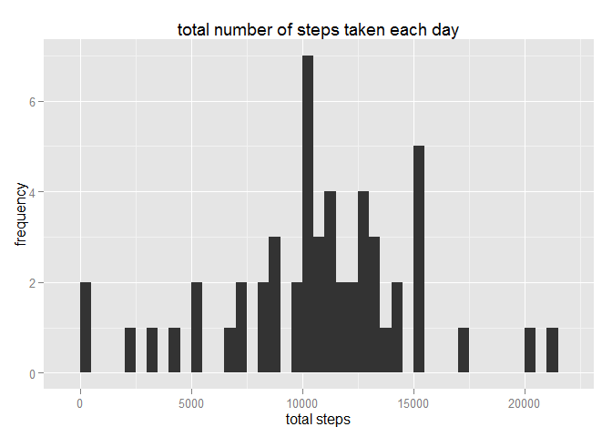
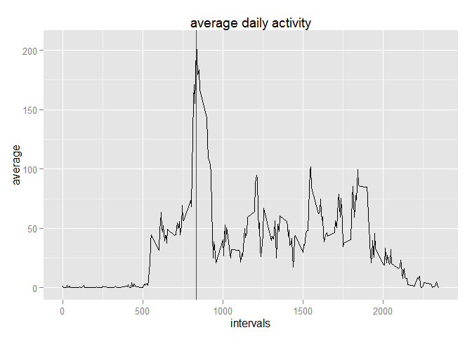
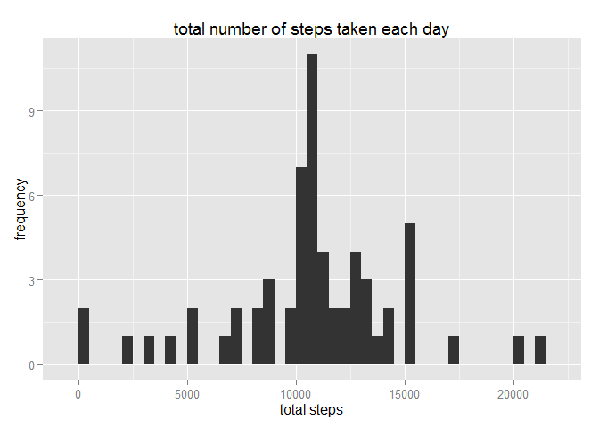
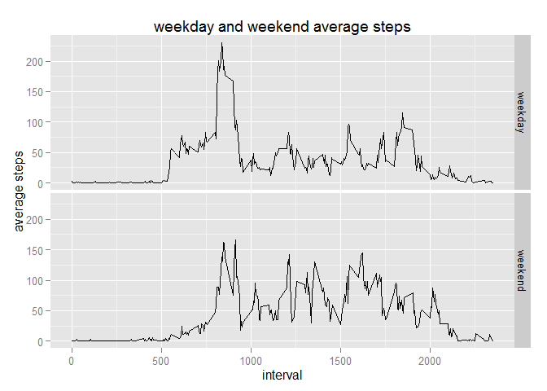

# Reproducible Research: Peer Assessment 1


## Loading and preprocessing the data

```r
#unzip file
unzip('activity.zip',overwrite = F) #unzip activity file
```

```
## Warning in unzip("activity.zip", overwrite = F): not overwriting file './
## activity.csv
```

```r
data<-read.csv(file = 'activity.csv') #load data
library(lubridate)
#convert to date
data$date<-ymd(data$date)
```

## What is mean total number of steps taken per day?

```r
library(dplyr)
```

```
## 
## Attaching package: 'dplyr'
## 
## The following objects are masked from 'package:lubridate':
## 
##     intersect, setdiff, union
## 
## The following objects are masked from 'package:stats':
## 
##     filter, lag
## 
## The following objects are masked from 'package:base':
## 
##     intersect, setdiff, setequal, union
```

```r
#aggregation for total steps per day
sData<- data %>% filter(!is.na(steps)) %>% group_by(date) %>% select(steps) %>% summarise(totalSteps=sum(steps))
#plots
library(ggplot2)
ggplot(data=sData, aes(totalSteps))+geom_histogram(binwidth = 500)+ 
  xlab("total steps")+ylab("frequency")+
  ggtitle("total number of steps taken each day")
```

 

```r
#mean and median
print(paste0("mean: ",mean(sData$totalSteps)))
```

```
## [1] "mean: 10766.1886792453"
```

```r
print(paste0("median: ",median(sData$totalSteps)))
```

```
## [1] "median: 10765"
```


## What is the average daily activity pattern?

```r
#average per interval
avgData<- data %>% group_by(interval) %>% select(steps) %>% summarise(avgSteps=mean(steps, na.rm=T))

#max
mx<-max(avgData$avgSteps,na.rm = T)
#interval of max
i<-avgData[avgData$avgSteps==mx,1][[1]]

print(paste0("maximum: ",mx))
```

```
## [1] "maximum: 206.169811320755"
```

```r
print(paste0("interval of maximum: ",i))
```

```
## [1] "interval of maximum: 835"
```

```r
#plot
ggplot(data=avgData, aes(interval,avgSteps))+geom_line()+ 
  xlab("intervals")+ylab("average")+
  ggtitle("average daily activity")+geom_vline(aes(xintercept=i), color="red")
```

 


## Imputing missing values

```r
#na statistic
nna<-length(data[is.na(data$steps),1])
print(paste0("number of NA values: ",nna))
```

```
## [1] "number of NA values: 2304"
```

```r
newData<-data
avgData<-avgData[,1:2]
newData<-merge(newData,avgData) #merging with dataset of areverage values per interval

#replace na values with averages
newData[is.na(newData$steps),"steps"]<-newData[is.na(newData$steps),"avgSteps"]

#aggregation for total steps per day
sData<- newData %>% group_by(date) %>% select(steps) %>% summarise(totalSteps=sum(steps))
ggplot(data=sData, aes(totalSteps))+geom_histogram(binwidth = 500)+ 
  xlab("total steps")+ylab("frequency")+
  ggtitle("total number of steps taken each day")
```

 

```r
print(paste0("mean: ",mean(sData$totalSteps)))
```

```
## [1] "mean: 10766.1886792453"
```

```r
print(paste0("median: ",median(sData$totalSteps)))
```

```
## [1] "median: 10766.1886792453"
```

As you can see median is different to median from first step
The histogram after changing missing values is different around median
## Are there differences in activity patterns between weekdays and weekends?

```r
dataWeekdays<-newData
#finds weekdays and weekend
dataWeekdays$weekend<-factor(ifelse(weekdays(dataWeekdays$date) %in% c("Saturday", "Sunday"),"weekend","weekday"))

#averages per interval and weekday/weekend
avgWeekdaysData<- dataWeekdays %>% group_by(interval, weekend) %>% select(steps) %>% summarise(avgSteps=mean(steps))

#plot
ggplot(data=avgWeekdaysData)+geom_line(aes(interval,avgSteps))+facet_grid(weekend~.)+
xlab("interval")+ylab("average steps")+
  ggtitle("weekday and weekend average steps")
```

 
